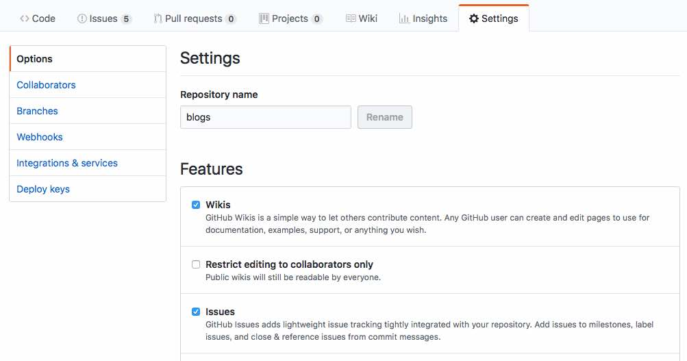
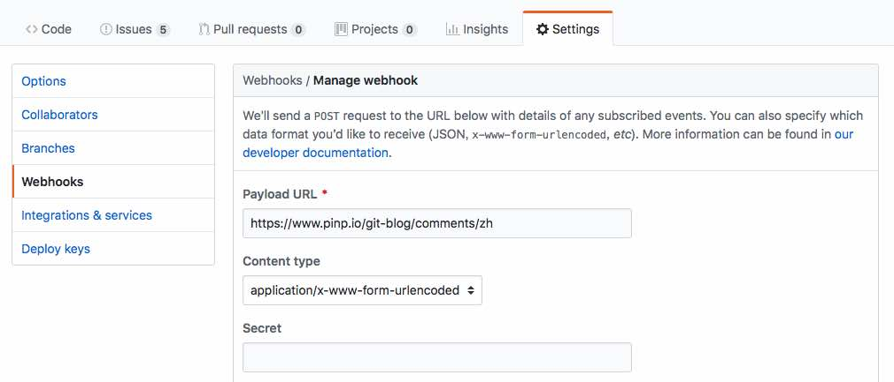

## 如何 Fork 本库，创建自己的博客系统

第 1 步，在 github.com 打开本库，即 [rewgt/blogs](https://github.com/rewgt/blogs)，点击右上角的 fork 按钮，将本库 fork 到您自己的账号下。

完成这一步，您将在 github.com 拥有一个归自己控制的 `<your_account>/blogs` 库。

第 2 步，在本机安装 shadow-widget 运行环境

``` bash
mkdir user
cd user
git clone https://github.com/rewgt/shadow-server.git
```

第 3 步，在本机克隆刚 fork 过来的 blogs 项目

``` bash
git clone https://github.com/<your_account>/blogs.git
```

说明：请替换上面 `<your_account>` 字串。

第 4 步，在本机创建博客

在本机启动一个 server：

``` bash
cd shadow-server
npm install
npm start
```

然后在浏览器访问 blogs 主页：`http://localhost:3000/blogs/`，创建、编辑、管理博客在该主页下进行。

第 5 步，将本地的博客提交到 github.com

在提交之前，您须用 `git config user.name "your name"` 与 `git config user.email "name@example.com"` 配置 git 库的用户名与邮箱。然后按 git 使用要求，依次用如下命令提交：

``` bash
git add .
git commit -m "message"
git push origin gh-pages
```

注意，要提交到 github 的 `gh-pages` 分支，这样才支持在 `https://<your_account>.github.io/blogs/` 打开您的博客站点。

&nbsp;

## 让博客支持评论

本博客系统支持评论功能，该功能借助 github 的 Issues 功能实现。从 `rewgt/blogs` 把库 fork 过来时，系统缺省关闭了 Issues 功能，您应到自己的 blogs 库主页，打开 `Settings` 配置页，在 `Options` 分类下，把 "Issues" 的 Features 项选上。



另外，还得在 `Webhooks` 分类下，点 `Add webhook` 按钮，增加一条指向如下 URL 的记录。

``` html
https://www.pinp.io/git-blog/comments/zh
``` 



说明：
1. 配置 webhook 为了让你的博客每次 push 后，`www.pinp.io` 后台能为您新写的文章自动创建一条评论用 issue
2. 如果您用英文撰写博客，可换用这个 URL：`https://www.pinp.io/git-blog/comments/en`

&nbsp;

## 使用批处理，简化版本提交操作

经常写博客的朋友，会经常要在命令行键入多条命令（如 `git add, git commit, git push`）才能把博客发布到 github。为了让操作简化，我们提供了 `macpush` 与 `winpush` 两个批处理文件，前者用于在 Mac 机器中，只需运行 `./macpush` 即实现版本发布，后者用于在 Windows 机器一键发布。

&nbsp;

## 使用限制

本博客系统的客户端支持用主流浏览器访问，包括 Safari、Chrome、Firefox、IE、Opera 等，其中 IE 要求用 IE9 以上版本。对浏览器的最低要求正是 React 所提的要求，也与您撰写的文章是否用到特定 Web 特性有关，如果只用 markdown 编写简单的文档，遵循 React 最低运行环境的规定即可。如果您撰写文章深度依赖 HTML5 特性，比如绘制 chart 统计图，在客户端阅读时，IE 浏览器最好用 IE11 以后的版本（包括 Edge），其它浏览器也最好是近两年发布的版本。

本博客系统不只用浏览器阅读文章，也用它编辑文章。浏览器用作编辑时，IE 限用 Edge 以上的版本，因为太多 "IE Rocks"，只有 `Edge+` 才支持 Shadow Widget 的可视化设计器。其它主流浏览器则没什么特别要求，版本不要过于老旧即可。另外，编辑文章在本机进行，因启动一个 localhost 的 Web 服务，这要求在本机预装 NodeJs 与 NPM 运行环境。

&nbsp;

## 帮助文档

本库博客地址：<a target="_blank" rel="noopener" href="https://rewgt.github.io/blogs/">https://rewgt.github.io/blogs/</a>，如何撰写拼文，如何管理博客，如何提交等，在此博客的 `"Online help"` 子项里有介绍。

<a target="_blank" rel="noopener" href="https://rewgt.github.io/blogs/output/doc/doc_zh/">点击这里阅读 PINP Blog 开发者手册</a>

&nbsp;

## 版权

本库采用 WTFPL 协议（Do What The Fuck You Want To Public License）。

本库的本地编辑环境依赖于 [`shadow-server`](https://github.com/rewgt/shadow-server) 项目，`shadow-server` 按 `BSD 3-clause` 协议开源。

&nbsp;
